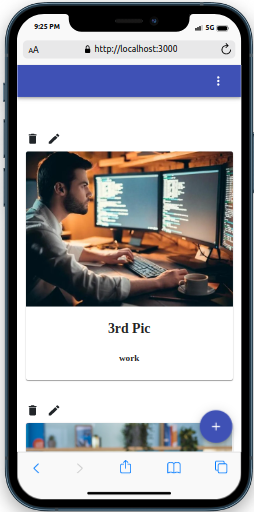

# Image Gallery App
<!-- Display two images  -->
<p align="center", style="display: flex; justify-content: space-between;">
  
  
</p>


## Project Description

Image gallery is a full-stack webapplication that allows users to upload images and view them in a gallery. The application contains a user authentication system that allows users to sign up and sign in. The application also allows users to upload images and view them in a gallery. The application also allows users to view the images they have uploaded and delete them.

## links

- Demo link: [N/A](N/A)

## Built With

- React
- Redux
- TypeScript
- NodeJs
- ExpressJs
- PostgreSQL
- TypeORM
- Jest

# Get Started
Follow these steps below:

## Pre-requisites

NB: To avoid any issue related to the versions of the dependencies, please use `nvm` to install the required node version. You can find the required node version in the `.nvmrc` file.

```bash
- NodeJs
- Yarn/NPM
- PostgreSQL
```

## Setup
Clone the repo and run bundle install in the command line to install the dependencies

```bash
$ git clone https://github.com/Kandy-Peter/gallery_app
$ cd gallery_app
```
```

## Install dependencies with:

```bash
cd server
$ yarn install

cd client
$ yarn install
```

Or with concurrently

```bash
cd server
$ yarn install && yarn client-install
```

## Run test

```bash
$ cd server
$ yarn jest-test

$ cd client
$ yarn test
```

## Start node server (nodemon)

1. Start server and UI separately

```bash
$ cd server
$ yarn server

$ cd client
$ yarn start
```
2. Start server and UI together

```bash
$ yan run dev
```

Open [http://localhost:3000/](http://localhost:3000/) in your browser

## Author

👤 **Kandi Peter**

- GitHub: [Kandi-Peter](https://github.com/Kandy-Peter)
- LinkedIn: [Kandi-Kamuntu](https://www.linkedin.com/in/kandi-peter-a49590212/)
- twitter: [Kandi_Peter](https://twitter.com/peter_kandy)

## 🤝 Contributing

Contributions, issues, and feature requests are welcome!

Feel free to check the [issues page](../../issues/).

## Show your support

Give a ⭐️ if you like this project!

## Acknowledgments

- Hat tip to anyone whose code was used
- Inspiration
- etc

## Desing inspiration:

Original design idea by [Gregoire Vella on Behance](https://www.behance.net/gregoirevella).

## 📝 License

See [PUBLIC](./LICENSE) license.
